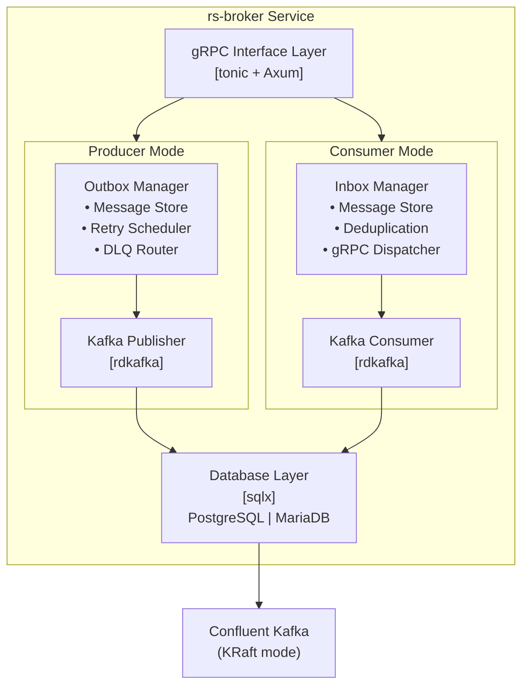

# rs-broker

A Rust-based microservice implementing the inbox/outbox pattern to decouple Kafka complexity from downstream services. It provides a unified gRPC interface for both message publishing and consumption, handling retry logic, dead-letter queues, and idempotency automatically.

## Overview

rs-broker is a message broker abstraction layer that simplifies event-driven architectures by:

- **Inbox/Outbox Pattern**: Reliable message delivery using database-backed outbox and inbox tables
- **gRPC Interface**: Type-safe API for both publishing and subscribing to Kafka topics
- **Automatic Retry Logic**: Exponential backoff with configurable retry policies
- **Dead Letter Queue (DLQ)**: Automatic routing of failed messages for later analysis
- **Circuit Breaker**: Protection against downstream service failures
- **Idempotency**: Built-in deduplication for exactly-once semantics

## Architecture



## Key Features

- **Reliable Message Delivery**: At-least-once delivery with transactional outbox
- **Idempotent Processing**: Automatic deduplication at both producer and consumer
- **Smart Retries**: Exponential backoff with jitter and per-message configuration
- **DLQ Support**: Automatic routing of permanently failed messages
- **Circuit Breaker**: Protects against cascading failures in downstream services
- **Flexible Subscriptions**: Pattern-based topic subscriptions with wildcards
- **Health Monitoring**: Built-in health checks and metrics

## Quick Start

### Prerequisites

- Docker & Docker Compose (recommended)
- Or for local development:
  - Rust 1.75+ (install via [rustup](https://rustup.rs/))
  - CMake 3.15+ (for rdkafka)
  - Protocol Buffers compiler (protoc)

### Docker (Recommended)

1. Clone and start:

```bash
git clone https://github.com/bouroo/rs-broker.git
cd rs-broker
cp .env.example .env

# Start core services (PostgreSQL, Kafka, rs-broker)
docker-compose up -d

# Start with Kafka UI
docker-compose --profile ui up -d

# Start everything (monitoring, demo, UI)
docker-compose --profile full up -d
```

2. Verify services:

```bash
# Health check
curl http://localhost:8080/health

# Metrics
curl http://localhost:9090/metrics

# Kafka UI (if using --profile ui)
open http://localhost:8082
```

### Local Development

1. Start infrastructure only:

```bash
docker-compose up -d postgres kafka
```

2. Build and run:

```bash
cargo build --release
cargo run --release
```

### Running the Service

```bash
# Development mode
cargo run

# Production mode
cargo run --release

# Producer mode only
RS_BROKER_SERVER__MODE=producer cargo run

# Consumer mode only
RS_BROKER_SERVER__MODE=consumer cargo run
```

## Configuration

Configuration is loaded in the following order (later sources override earlier):

1. `config/default.toml` - Base configuration
2. `config/{environment}.toml` - Environment-specific config
3. Environment variables with `RS_BROKER_` prefix
4. Command-line arguments

### Server Configuration

| Variable | Default | Description |
|----------|---------|-------------|
| `RS_BROKER_SERVER__MODE` | `both` | Server mode: `producer`, `consumer`, or `both` |
| `RS_BROKER_SERVER__HOST` | `0.0.0.0` | HTTP server host |
| `RS_BROKER_SERVER__HTTP_PORT` | `8080` | HTTP server port |
| `RS_BROKER_SERVER__GRPC_PORT` | `50051` | gRPC server port |
| `RS_BROKER_SERVER__SHUTDOWN_TIMEOUT_SECS` | `30` | Graceful shutdown timeout |
| `RS_BROKER_SERVER__REQUEST_TIMEOUT_SECS` | `30` | Request timeout |

### Database Configuration

| Variable | Default | Description |
|----------|---------|-------------|
| `RS_BROKER_DATABASE__TYPE` | `postgres` | Database type: `postgres` or `mysql` |
| `RS_BROKER_DATABASE__HOST` | `localhost` | Database host |
| `RS_BROKER_DATABASE__PORT` | `5432` | Database port |
| `RS_BROKER_DATABASE__USERNAME` | `rsbroker` | Database username |
| `RS_BROKER_DATABASE__PASSWORD` | - | Database password |
| `RS_BROKER_DATABASE__DATABASE` | `rsbroker` | Database name |
| `RS_BROKER_DATABASE__MAX_CONNECTIONS` | `25` | Maximum connections |
| `RS_BROKER_DATABASE__MIN_CONNECTIONS` | `5` | Minimum connections |
| `RS_BROKER_DATABASE__AUTO_MIGRATE` | `true` | Run migrations on startup |

### Kafka Configuration

| Variable | Default | Description |
|----------|---------|-------------|
| `RS_BROKER_KAFKA__BROKERS` | `localhost:9092` | Kafka broker addresses |
| `RS_BROKER_KAFKA__CONSUMER_GROUP_ID` | `rs-broker-consumer` | Consumer group ID |
| `RS_BROKER_KAFKA__CLIENT_ID` | `rs-broker` | Client ID |
| `RS_BROKER_KAFKA__SECURITY_PROTOCOL` | `plaintext` | Security protocol |
| `RS_BROKER_KAFKA__SASL_MECHANISM` | `PLAIN` | SASL mechanism |
| `RS_BROKER_KAFKA__SASL_USERNAME` | - | SASL username |
| `RS_BROKER_KAFKA__SASL_PASSWORD` | - | SASL password |

### Retry Configuration

| Variable | Default | Description |
|----------|---------|-------------|
| `RS_BROKER_RETRY__MAX_RETRIES` | `5` | Maximum retry attempts |
| `RS_BROKER_RETRY__INITIAL_DELAY_MS` | `1000` | Initial delay in ms |
| `RS_BROKER_RETRY__MULTIPLIER` | `2.0` | Exponential backoff multiplier |
| `RS_BROKER_RETRY__MAX_DELAY_MS` | `60000` | Maximum delay in ms |
| `RS_BROKER_RETRY__JITTER_FACTOR` | `0.1` | Jitter factor (0.0-1.0) |

### Logging & Metrics

| Variable | Default | Description |
|----------|---------|-------------|
| `RUST_LOG` | `info` | Log level: `trace`, `debug`, `info`, `warn`, `error` |
| `RS_BROKER_LOGGING__FORMAT` | `json` | Log format: `json` or `pretty` |
| `RS_BROKER_METRICS__ENABLED` | `true` | Enable Prometheus metrics |
| `RS_BROKER_METRICS__PORT` | `9090` | Metrics port |

## API Usage

### Service Endpoints

| Port | Protocol | Description |
|------|----------|-------------|
| 8080 | HTTP | REST API & health checks |
| 50051 | gRPC | gRPC service |
| 9090 | HTTP | Prometheus metrics |

### Publishing Messages

Using gRPC, you can publish messages to Kafka through the outbox:

```bash
# Using grpcurl
grpcurl -plaintext -d '{
  "aggregate_type": "Order",
  "aggregate_id": "order-123",
  "event_type": "OrderCreated",
  "payload": "{\"amount\": 100, \"currency\": \"USD\"}",
  "topic": "orders"
}' localhost:50051 rsbroker.RsBroker/Publish
```

### Registering Subscribers

Register your service to receive messages:

```bash
grpcurl -plaintext -d '{
  "subscriber_id": "order-service-1",
  "service_name": "order-service",
  "grpc_endpoint": "localhost:50052",
  "topic_patterns": ["orders.*", "payments.created"]
}' localhost:50051 rsbroker.RsBroker/RegisterSubscriber
```

### Consuming Events

Subscribe to the event stream:

```bash
grpcurl -plaintext -d '{
  "subscriber_id": "order-service-1",
  "topic_patterns": ["orders.*"],
  "position": "LATEST"
}' localhost:50051 rsbroker.RsBroker/SubscribeEvents
```

## Project Structure

```
rs-broker/
├── Cargo.toml                 # Workspace manifest
├── Dockerfile                 # Multi-stage production build
├── compose.yml                # Docker Compose with profiles
├── crates/
│   ├── rs-broker-config/      # Configuration management
│   ├── rs-broker-core/        # Core business logic
│   ├── rs-broker-db/          # Database layer (sqlx)
│   ├── rs-broker-kafka/       # Kafka producer/consumer
│   ├── rs-broker-proto/       # gRPC protobuf definitions
│   └── rs-broker-server/      # Server binary
├── deploy/
│   └── prometheus.yml         # Prometheus scrape config
├── examples/
│   ├── demo.sh                # gRPC demo script
│   └── subscriber_client.py   # Sample subscriber
├── docs/                      # Documentation
├── migrations/                # SQL migrations
└── proto/                     # Protocol Buffers
```

## Development

### Running Tests

```bash
# Run all tests
cargo test

# Run tests with output
cargo test -- --nocapture

# Run specific crate tests
cargo test -p rs-broker-core
```

### Running Migrations

```bash
# Migrations run automatically with auto_migrate=true
# Or manually with SQL client:
psql -U rsbroker -d rsbroker -f migrations/0001_init.sql
```

### Code Generation

```bash
# Regenerate protobuf
cargo build -p rs-broker-proto
```

## Deployment

### Docker

#### Multi-Stage Dockerfile

The Dockerfile supports multiple targets:

```bash
# Production (distroless - minimal)
docker build -t rs-broker:latest .
docker build -t rs-broker:latest --target production .

# Development (alpine - with shell)
docker build -t rs-broker:dev --target development .

# With MySQL support
docker build -t rs-broker:mysql --build-arg DATABASE_FEATURE=mysql .
```

#### Running Containers

```bash
# Basic run
docker run -d --name rs-broker \
  -p 8080:8080 -p 50051:50051 -p 9090:9090 \
  --env-file .env \
  rs-broker:latest

# With environment overrides
docker run -d --name rs-broker \
  -p 8080:8080 -p 50051:50051 -p 9090:9090 \
  -e RS_BROKER_DATABASE__HOST=postgres \
  -e RS_BROKER_KAFKA__BROKERS=kafka:9092 \
  rs-broker:latest
```

### Docker Compose Profiles

| Profile | Services | Description |
|---------|----------|-------------|
| (default) | postgres, kafka, rs-broker | Core services |
| `producer` | + rs-broker-producer | Producer mode only |
| `consumer` | + rs-broker-consumer | Consumer mode only |
| `ui` | + kafka-ui | Kafka monitoring UI |
| `monitoring` | + prometheus | Prometheus metrics |
| `avro` | + schema-registry | Schema Registry |
| `demo` | + demo-subscriber | Demo client |
| `full` | All services | Complete stack |

```bash
# Core services only
docker-compose up -d

# With Kafka UI
docker-compose --profile ui up -d

# Producer/Consumer split deployment
docker-compose --profile producer --profile consumer up -d

# Full stack with monitoring
docker-compose --profile full up -d

# Cleanup
docker-compose down -v
```

### Demo Script

Test rs-broker features with the included demo script:

```bash
# Install grpcurl first
go install github.com/fullstorydev/grpcurl/cmd/grpcurl@latest

# Run demo
./examples/demo.sh check      # Check connection
./examples/demo.sh publish    # Publish test message
./examples/demo.sh batch      # Publish batch
./examples/demo.sh register   # Register subscriber
./examples/demo.sh full       # Full demo
./examples/demo.sh help       # Show all commands
```

### Kubernetes

Apply the Kubernetes manifests:

```bash
kubectl apply -f k8s/
```

## License

MIT License - see [LICENSE](LICENSE) for details.
