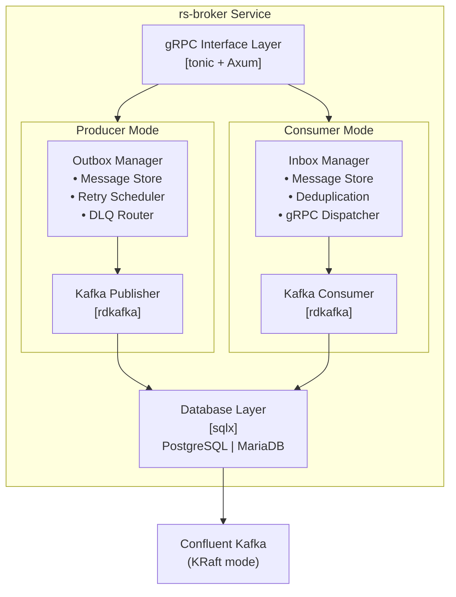

# rs-broker

[](https://github.com/bouroo/rs-broker/actions/workflows/rust.yml)
[](LICENSE)
[](https://rustup.rs/)
[](Cargo.toml)
[](https://github.com/bouroo/rs-broker/graphs/contributors)
[](https://github.com/bouroo/rs-broker)

A Rust-based microservice implementing the inbox/outbox pattern to decouple Kafka complexity from downstream services. It provides a unified gRPC interface for both message publishing and consumption, handling retry logic, dead-letter queues, and idempotency automatically.

## ✨ Features

- 📦 **Inbox/Outbox Pattern** — Reliable message delivery using database-backed outbox and inbox tables
- 🔌 **gRPC Interface** — Type-safe API for both publishing and subscribing to Kafka topics
- 🌐 **HTTP REST + SSE API** — Full JSON parity with the gRPC surface under `/api/v1`, including an SSE event stream
- 🔄 **Automatic Retry Logic** — Exponential backoff with configurable retry policies and jitter
- ☠️ **Dead Letter Queue (DLQ)** — Automatic routing of failed messages for later analysis
- 🔒 **Circuit Breaker** — Protection against downstream service failures
- 🧮 **Idempotency** — Built-in deduplication for exactly-once semantics
- 📡 **Flexible Subscriptions** — Pattern-based topic subscriptions with wildcards
- 💚 **Health Monitoring** — Built-in health checks and Prometheus metrics

## 🏗️ Architecture


```mermaid
flowchart TB
    subgraph rsbroker["rs-broker Service"]
        grpc["gRPC Interface Layer<br/>[tonic + Axum]"]
        
        subgraph producer["Producer Mode"]
            outbox["Outbox Manager<br/>• Message Store<br/>• Retry Scheduler<br/>• DLQ Router"]
            pub["Kafka Publisher<br/>[rdkafka]"]
        end
        
        subgraph consumer["Consumer Mode"]
            inbox["Inbox Manager<br/>• Message Store<br/>• Deduplication<br/>• gRPC Dispatcher"]
            sub["Kafka Consumer<br/>[rdkafka]"]
        end
        
        db["Database Layer<br/>[sqlx]<br/>PostgreSQL | MariaDB"]
    end
    
    grpc --> producer
    grpc --> consumer
    outbox --> pub
    inbox --> sub
    pub --> db
    sub --> db
    db --> kafka
    
    kafka["Confluent Kafka<br/>(KRaft mode)"]
```

## 🚀 Quick Start

### Prerequisites

- Docker & Docker Compose (recommended)
- Or for local development: Rust 1.75+, CMake 3.15+ (for rdkafka), protoc

### Docker (Recommended)

```bash
git clone https://github.com/bouroo/rs-broker.git
cd rs-broker
cp .env.example .env

# Core services (PostgreSQL, Kafka, rs-broker)
docker compose up -d

# With Kafka UI (optional)
docker compose --profile ui up -d

# Full stack with monitoring (optional)
docker compose --profile full up -d
```

Verify services:

```bash
curl http://localhost:8080/health   # Health check
curl http://localhost:9090/metrics  # Metrics endpoint
```

### Local Development

```bash
# Start infrastructure only
docker compose up -d postgres kafka

# Build and run rs-broker locally
cargo build --release && cargo run --release
```

### Running the Service

```bash
cargo run                           # Development mode (both)
RS_BROKER_SERVER__MODE=producer cargo run   # Producer only
RS_BROKER_SERVER__MODE=consumer cargo run   # Consumer only
```

## 📡 API Usage

| Port | Protocol | Description |
|------|----------|-------------|
| 8080 | HTTP | REST API & health checks |
| 50051 | gRPC | gRPC service |
| 9090 | HTTP | Prometheus metrics |

### Publishing Messages (gRPC)

```bash
grpcurl -plaintext -d '{
  "aggregate_type": "Order",
  "aggregate_id": "order-123",
  "event_type": "OrderCreated",
  "payload": "{\"amount\": 100, \"currency\": \"USD\"}",
  "topic": "orders"
}' localhost:50051 rsbroker.RsBroker/Publish
```

### Registering Subscribers (gRPC)

```bash
grpcurl -plaintext -d '{
  "subscriber_id": "order-service-1",
  "service_name": "order-service",
  "grpc_endpoint": "localhost:50052",
  "topic_patterns": ["orders.*", "payments.created"]
}' localhost:50051 rsbroker.RsBroker/RegisterSubscriber
```

### Consuming Events (gRPC)

```bash
grpcurl -plaintext -d '{
  "subscriber_id": "order-service-1",
  "topic_patterns": ["orders.*"],
  "position": "LATEST"
}' localhost:50051 rsbroker.RsBroker/SubscribeEvents
```

### HTTP REST + SSE (parity with gRPC)

The same operations are available as JSON under `/api/v1` on the HTTP port —
see [docs/http-api.md](docs/http-api.md):

```bash
# Publish
curl -s localhost:8080/api/v1/publish -H 'content-type: application/json' -d '{
  "aggregate_type": "Order",
  "aggregate_id": "order-123",
  "event_type": "OrderCreated",
  "payload": {"amount": 100, "currency": "USD"},
  "topic": "orders"
}'

# Stream events (SSE, pattern-filtered)
curl -N "localhost:8080/api/v1/events/stream?subscriber_id=demo&patterns=orders.*"
```

## ⚙️ Configuration

Configuration is loaded in the following order (later sources override earlier):

1. `config/default.toml` — Base configuration
2. `config/{environment}.toml` — Environment-specific config
3. Environment variables with `RS_BROKER_` prefix
4. Command-line arguments

### Server

| Variable | Default | Description |
|----------|---------|-------------|
| `RS_BROKER_SERVER__MODE` | `both` | Server mode: `producer`, `consumer`, or `both` |
| `RS_BROKER_SERVER__HOST` | `0.0.0.0` | HTTP server host |
| `RS_BROKER_SERVER__HTTP_PORT` | `8080` | HTTP server port |
| `RS_BROKER_SERVER__GRPC_PORT` | `50051` | gRPC server port |
| `RS_BROKER_SERVER__SHUTDOWN_TIMEOUT_SECS` | `30` | Graceful shutdown timeout |
| `RS_BROKER_SERVER__REQUEST_TIMEOUT_SECS` | `30` | Request timeout |

### Database

| Variable | Default | Description |
|----------|---------|-------------|
| `RS_BROKER_DATABASE__TYPE` | `postgres` | Database type: `postgres` or `mysql` |
| `RS_BROKER_DATABASE__HOST` | `localhost` | Database host |
| `RS_BROKER_DATABASE__PORT` | `5432` | Database port |
| `RS_BROKER_DATABASE__USERNAME` | `rsbroker` | Database username |
| `RS_BROKER_DATABASE__PASSWORD` | - | Database password |
| `RS_BROKER_DATABASE__DATABASE` | `rsbroker` | Database name |
| `RS_BROKER_DATABASE__MAX_CONNECTIONS` | `25` | Maximum connections |
| `RS_BROKER_DATABASE__MIN_CONNECTIONS` | `5` | Minimum connections |
| `RS_BROKER_DATABASE__AUTO_MIGRATE` | `true` | Run migrations on startup |

### Kafka

| Variable | Default | Description |
|----------|---------|-------------|
| `RS_BROKER_KAFKA__BROKERS` | `localhost:9092` | Kafka broker addresses |
| `RS_BROKER_KAFKA__CONSUMER_GROUP_ID` | `rs-broker-consumer` | Consumer group ID |
| `RS_BROKER_KAFKA__CLIENT_ID` | `rs-broker` | Client ID |
| `RS_BROKER_KAFKA__SECURITY_PROTOCOL` | `plaintext` | Security protocol |
| `RS_BROKER_KAFKA__SASL_MECHANISM` | `PLAIN` | SASL mechanism |
| `RS_BROKER_KAFKA__SASL_USERNAME` | - | SASL username |
| `RS_BROKER_KAFKA__SASL_PASSWORD` | - | SASL password |

### Retry

| Variable | Default | Description |
|----------|---------|-------------|
| `RS_BROKER_RETRY__MAX_RETRIES` | `5` | Maximum retry attempts |
| `RS_BROKER_RETRY__INITIAL_DELAY_MS` | `1000` | Initial delay in ms |
| `RS_BROKER_RETRY__MULTIPLIER` | `2.0` | Exponential backoff multiplier |
| `RS_BROKER_RETRY__MAX_DELAY_MS` | `60000` | Maximum delay in ms |
| `RS_BROKER_RETRY__JITTER_FACTOR` | `0.1` | Jitter factor (0.0–1.0) |

### Logging & Metrics

| Variable | Default | Description |
|----------|---------|-------------|
| `RUST_LOG` | `info` | Log level: `trace`, `debug`, `info`, `warn`, `error` |
| `RS_BROKER_LOGGING__FORMAT` | `json` | Log format: `json` or `pretty` |
| `RS_BROKER_METRICS__ENABLED` | `true` | Enable Prometheus metrics |
| `RS_BROKER_METRICS__PORT` | `9090` | Metrics port |

## 📁 Project Structure

```
rs-broker/
├── Cargo.toml                 # Workspace manifest
├── Containerfile                 # Multi-stage production build
├── compose.yml                # Docker Compose with profiles
├── crates/
│   ├── rs-broker-config/      # Configuration management
│   ├── rs-broker-core/        # Core business logic
│   ├── rs-broker-db/          # Database layer (sqlx)
│   ├── rs-broker-kafka/       # Kafka producer/consumer
│   ├── rs-broker-proto/       # gRPC protobuf definitions
│   └── rs-broker-server/      # Server binary
├── deploy/                    # Prometheus config
├── examples/                  # Demo scripts & clients
├── docs/                      # Documentation
├── migrations/                # SQL migrations
└── proto/                     # Protocol Buffers
```

## 🛠️ Development

### Running Tests

```bash
cargo test                           # All tests
cargo test -- --nocapture            # Verbose output
cargo test -p rs-broker-core         # Specific crate
```

### Running Migrations

Migrations run automatically with `auto_migrate=true`. Or manually:

```bash
psql -U rsbroker -d rsbroker -f migrations/0001_init.sql
```

### Code Generation

```bash
cargo build -p rs-broker-proto   # Regenerate protobuf bindings
```

### Git Hooks

This repo ships git hooks that run the verify pipeline before commits and pushes.

```bash
make install-hooks              # Symlink hooks into .git/hooks/
make install-hooks -- --force   # Overwrite existing (backs them up)
```

| Hook | Profile | Stages |
|------|---------|--------|
| `pre-commit` | `fast` | `cargo fmt --check`, `cargo clippy -D warnings`, `cargo check --workspace` |
| `pre-push` | `full` | fast stages + `cargo test --workspace` |

Run the pipeline manually:

```bash
make verify        # Full (fast + test)
make verify-fast   # Fast only
```

Bypass a hook when needed:

```bash
git commit --no-verify
git push --no-verify
```

## 🐳 Deployment

### Docker — Multi-Stage Builds

The Containerfile supports multiple targets:

```bash
# Production (distroless — minimal)
docker build -t rs-broker:latest --target production .

# Development (alpine — with shell)
docker build -t rs-broker:dev --target development .

# With MySQL support
docker build -t rs-broker:mysql --build-arg DATABASE_FEATURE=mysql .
```

### Running Containers

```bash
# Basic run with env file
docker run -d --name rs-broker \
  -p 8080:8080 -p 50051:50051 -p 9090:9090 \
  --env-file .env rs-broker:latest

# With inline overrides
docker run -d --name rs-broker \
  -p 8080:8080 -p 50051:50051 -p 9090:9090 \
  -e RS_BROKER_DATABASE__HOST=postgres \
  -e RS_BROKER_KAFKA__BROKERS=kafka:9092 \
  rs-broker:latest
```

### Docker Compose Profiles

| Profile | Services | Description |
|---------|----------|-------------|
| (default) | postgres, kafka, rs-broker | Core services |
| `producer` | + rs-broker-producer | Producer mode only |
| `consumer` | + rs-broker-consumer | Consumer mode only |
| `ui` | + kafka-ui | Kafka monitoring UI |
| `monitoring` | + prometheus | Prometheus metrics |
| `avro` | + schema-registry | Schema Registry |
| `demo` | + demo-subscriber | Demo client |
| `full` | All services | Complete stack |

```bash
docker compose up -d                              # Core only
docker compose --profile ui up -d                 # With Kafka UI
docker compose --profile producer --profile consumer up -d  # Split deployment
docker compose --profile full up -d               # Full stack
docker compose down -v                            # Cleanup
```

### Demo Script

Test rs-broker features with the included demo script (requires [`grpcurl`](https://github.com/fullstorydev/grpcurl)):

```bash
./examples/demo.sh check      # Check connection
./examples/demo.sh publish    # Publish test message
./examples/demo.sh batch      # Publish batch
./examples/demo.sh register   # Register subscriber
./examples/demo.sh full       # Full demo
./examples/demo.sh help       # Show all commands
```

### Kubernetes

```bash
kubectl apply -f k8s/
```

## License

MIT License — see [LICENSE](LICENSE) for details.
