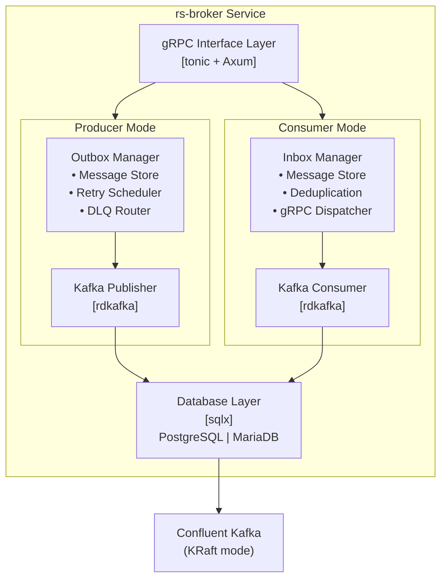
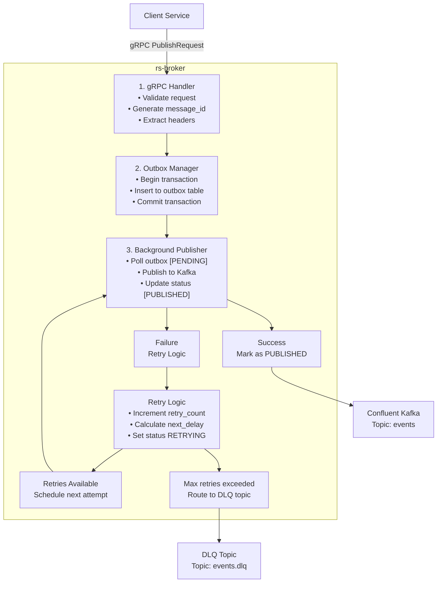
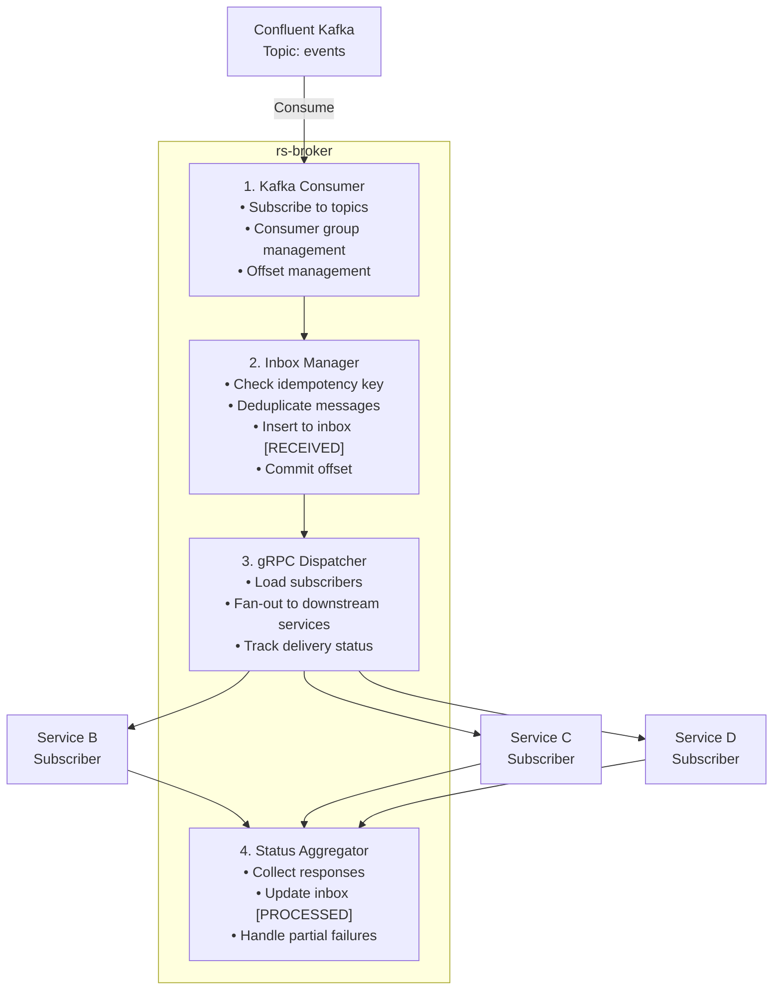
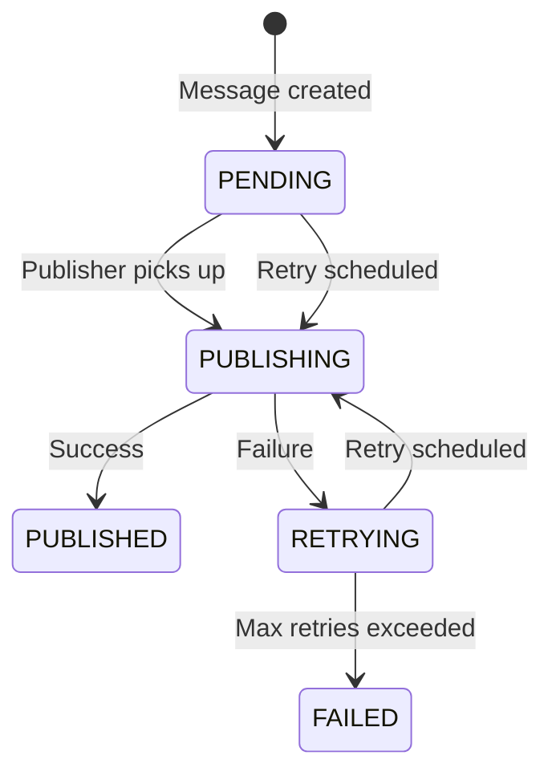
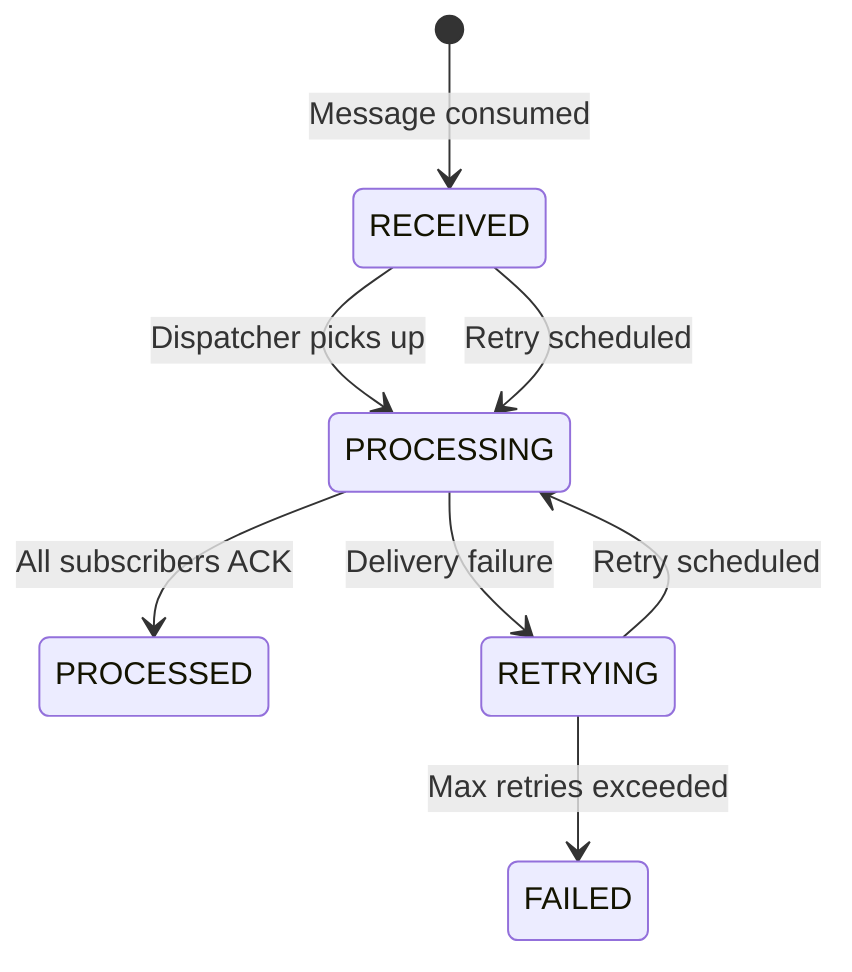
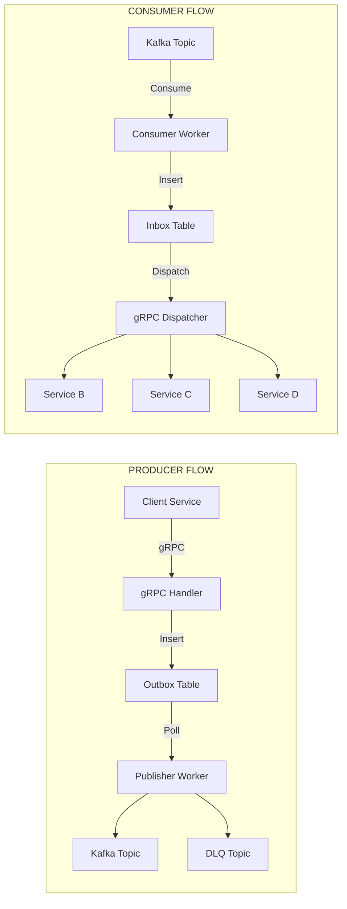

# rs-broker Architecture

## Overview

`rs-broker` is a Rust-based microservice implementing the inbox/outbox pattern to decouple Kafka complexity from downstream services. It provides a unified gRPC interface for both message publishing and consumption, handling retry logic, dead-letter queues, and idempotency automatically.

## Core Principles

- **Transparency**: Kafka complexity is hidden from clients
- **Reliability**: At-least-once delivery with idempotent processing
- **Resilience**: Automatic retries with exponential backoff
- **Scalability**: Async non-blocking operations throughout
- **Flexibility**: Database-agnostic with pluggable backends

## High-Level Architecture

## Component Diagrams

### Producer Mode - Outbox Flow

### Consumer Mode - Inbox Flow

## Message Lifecycle

### Producer Message States

### Consumer Message States

## Retry Strategy

### Exponential Backoff Configuration

| Retry Attempt | Delay | Formula |
|---------------|-------|---------|
| 1st retry | 1 second | `base_delay * 2^0` |
| 2nd retry | 2 seconds | `base_delay * 2^1` |
| 3rd retry | 4 seconds | `base_delay * 2^2` |
| 4th retry | 8 seconds | `base_delay * 2^3` |
| 5th retry | 16 seconds | `base_delay * 2^4` |
| Nth retry | min(max_delay) | `min(base_delay * 2^(n-1), max_delay)` |

### Kafka Headers for Retry

| Header | Type | Description |
|--------|------|-------------|
| `x-message-id` | String | Unique message identifier UUID |
| `x-retry-count` | Integer | Current retry attempt number |
| `x-retry-delay` | Integer | Delay in milliseconds before next retry |
| `x-original-topic` | String | Original topic before DLQ routing |
| `x-error-reason` | String | Last error message |
| `x-timestamp` | Long | Message creation timestamp |

## Idempotency Design

### Producer Side
- Message ID generated as UUID v4 at ingestion
- Unique constraint on `outbox.message_id`
- Duplicate publish attempts return existing message status

### Consumer Side
- Idempotency key from Kafka header `x-message-id`
- Unique constraint on `inbox.message_id`
- Duplicate consume attempts return existing processing status
- Subscriber deliveries tracked in `inbox_deliveries` table

## Data Flow Summary

## Key Design Decisions

| Decision | Rationale |
|----------|-----------|
| Separate outbox/inbox tables | Clear separation of concerns, independent scaling |
| Background publisher worker | Non-blocking API responses, batch efficiency |
| Database-agnostic via sqlx | Support PostgreSQL, MariaDB with feature flags |
| gRPC over HTTP REST | Type safety, streaming support, better performance |
| Idempotency at database level | Guaranteed deduplication even under failures |
| Configurable retry policies | Adapt to different SLA requirements |
| DLQ per topic pattern | Easier monitoring and reprocessing |
