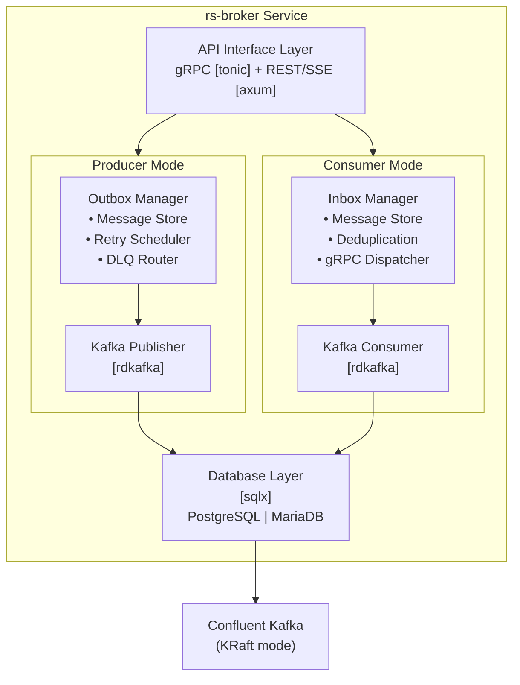
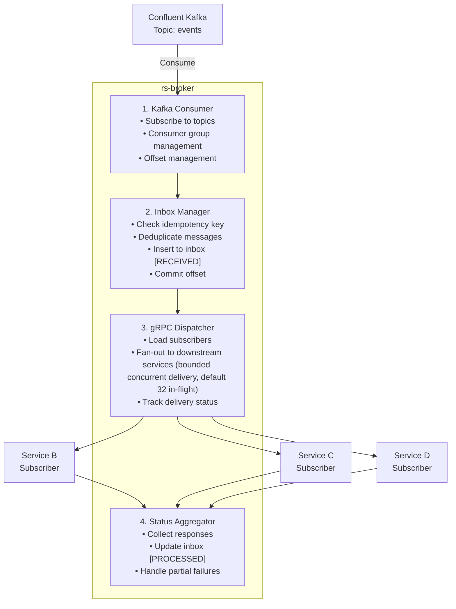
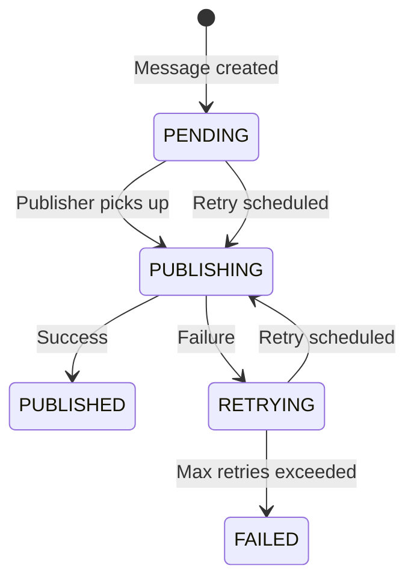
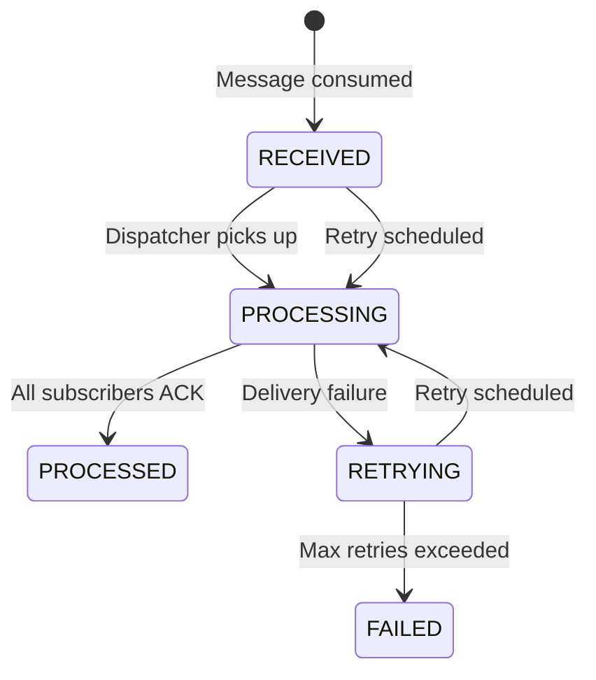
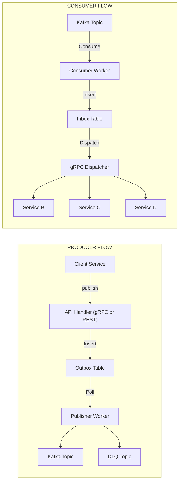

# rs-broker Architecture

## Overview

`rs-broker` is a Rust-based microservice implementing the inbox/outbox pattern to decouple Kafka complexity from downstream services. It provides a unified interface — gRPC and HTTP/JSON (REST + SSE) — for both message publishing and consumption, handling retry logic, dead-letter queues, and idempotency automatically.

## Core Principles

- **Transparency**: Kafka complexity is hidden from clients
- **Reliability**: At-least-once delivery with idempotent processing
- **Resilience**: Automatic retries with exponential backoff
- **Scalability**: Async non-blocking operations throughout
- **Flexibility**: Database-agnostic with pluggable backends

### Layering (feature-based clean architecture)

The workspace follows the four-layer clean-architecture circle diagram with
dependencies pointing strictly inward:

| Layer | Where | Contents |
|---|---|---|
| Entities (domain) | `rs-broker-core::shared`, `rs-broker-core::features/*/domain` | Entities with behaviour (`OutboxMessage::evaluate_publish_failure`, `Subscriber::matches_topic`), value objects, the topic matcher |
| Use cases (application) | `rs-broker-core::features/*/use_cases|accept|handler|dispatcher` | `AcceptMessage`, `OutboxPublisher`, `InboxManager`, `SubscriberRegistry`, `SubscriberDispatcher`, `DlqHandler` |
| Interface adapters | `rs-broker-db` (sqlx repos), `rs-broker-kafka` (`KafkaMessageSink`), `rs-broker-server::{adapters,grpc,http,metrics}` | proto/JSON<->DTO conversion, persistence, transport |
| Frameworks & drivers | sqlx, rdkafka, tonic/axum, `rs-broker-config` | external machinery |

Dependency rule (compiler-enforced): `rs-broker-core` has **no** dependency on
`rs-broker-db`, `rs-broker-kafka`, `rs-broker-proto`, `tonic` or `sqlx` —
features declare ports (repository traits, `MessageSink`, `SubscriberNotifier`)
and the outward crates implement them. Composition (adapter construction and
injection) happens only in `rs-broker-server`.

## Transport Layer

Both client-facing transports share one `RsBrokerService` instance and the
same transport-free `*_inner` methods, so behavior, validation, and error text
are identical across gRPC and REST:

| Transport | Where | Notes |
|---|---|---|
| gRPC (tonic, port 50051) | `rs-broker-server::grpc` | Full proto surface incl. server-stream and bidi `StreamPublish` |
| REST + SSE (axum, port 8080, `/api/v1`) | `rs-broker-server::http` | 1:1 mapping of every RPC (see [http-api.md](http-api.md)); `SubscribeEvents` → SSE stream, `StreamPublish` → batch endpoint |

Subscriber **push delivery** (the broker calling a registered subscriber's
`Deliver` callback) is gRPC-only; HTTP clients consume via the SSE stream.

## High-Level Architecture

```mermaid
flowchart TB
    subgraph rsbroker["rs-broker Service"]
        grpc["API Interface Layer<br/>gRPC [tonic] + REST/SSE [axum]"]
        
        subgraph producer["Producer Mode"]
            outbox["Outbox Manager<br/>• Message Store<br/>• Retry Scheduler<br/>• DLQ Router"]
            pub["Kafka Publisher<br/>[rdkafka]"]
        end
        
        subgraph consumer["Consumer Mode"]
            inbox["Inbox Manager<br/>• Message Store<br/>• Deduplication<br/>• gRPC Dispatcher"]
            sub["Kafka Consumer<br/>[rdkafka]"]
        end
        
        db["Database Layer<br/>[sqlx]<br/>PostgreSQL | MariaDB"]
    end
    
    grpc --> producer
    grpc --> consumer
    outbox --> pub
    inbox --> sub
    pub --> db
    sub --> db
    db --> kafka
    
    kafka["Confluent Kafka<br/>(KRaft mode)"]
```

## Component Diagrams

### Producer Mode - Outbox Flow

```mermaid
flowchart TB
    client["Client Service"]
    
    subgraph rsbroker["rs-broker"]
        handler["1. API Handler (gRPC or REST)<br/>• Validate request<br/>• Generate message_id<br/>• Extract headers"]
        outbox["2. Outbox Manager<br/>• Begin transaction<br/>• Insert to outbox table<br/>• Commit transaction"]
        publisher["3. Background Publisher<br/>• Poll outbox [PENDING]<br/>• Publish to Kafka<br/>• Update status [PUBLISHED]"]
        success["Success<br/>Mark as PUBLISHED"]
        failure["Failure<br/>Retry Logic"]
        retry["Retry Logic<br/>• Increment retry_count<br/>• Calculate next_delay<br/>• Set status RETRYING"]
        retryAvail["Retries Available<br/>Schedule next attempt"]
        dlqRoute["Max retries exceeded<br/>Route to DLQ topic"]
    end
    
    kafka["Confluent Kafka<br/>Topic: events"]
    dlq["DLQ Topic<br/>Topic: events.dlq"]
    
    client -->|PublishRequest (gRPC or REST)| handler
    handler --> outbox
    outbox --> publisher
    publisher --> success
    publisher --> failure
    failure --> retry
    retry --> retryAvail
    retry --> dlqRoute
    retryAvail --> publisher
    success --> kafka
    dlqRoute --> dlq
```

### Consumer Mode - Inbox Flow

```mermaid
flowchart TB
    kafka["Confluent Kafka<br/>Topic: events"]
    
    subgraph rsbroker["rs-broker"]
        consumer["1. Kafka Consumer<br/>• Subscribe to topics<br/>• Consumer group management<br/>• Offset management"]
        inbox["2. Inbox Manager<br/>• Check idempotency key<br/>• Deduplicate messages<br/>• Insert to inbox [RECEIVED]<br/>• Commit offset"]
        dispatcher["3. gRPC Dispatcher<br/>• Load subscribers<br/>• Fan-out to downstream services (bounded concurrent delivery, default 32 in-flight)<br/>• Track delivery status"]
        aggregator["4. Status Aggregator<br/>• Collect responses<br/>• Update inbox [PROCESSED]<br/>• Handle partial failures"]
    end
    
    svcB["Service B<br/>Subscriber"]
    svcC["Service C<br/>Subscriber"]
    svcD["Service D<br/>Subscriber"]
    
    kafka -->|Consume| consumer
    consumer --> inbox
    inbox --> dispatcher
    dispatcher --> svcB
    dispatcher --> svcC
    dispatcher --> svcD
    svcB --> aggregator
    svcC --> aggregator
    svcD --> aggregator
```

## Message Lifecycle

### Producer Message States

```mermaid
stateDiagram-v2
    [*] --> PENDING: Message created
    PENDING --> PUBLISHING: Publisher picks up
    PUBLISHING --> PUBLISHED: Success
    PUBLISHING --> RETRYING: Failure
    RETRYING --> PUBLISHING: Retry scheduled
    RETRYING --> FAILED: Max retries exceeded
    PENDING --> PUBLISHING: Retry scheduled
```

### Consumer Message States

```mermaid
stateDiagram-v2
    [*] --> RECEIVED: Message consumed
    RECEIVED --> PROCESSING: Dispatcher picks up
    PROCESSING --> PROCESSED: All subscribers ACK
    PROCESSING --> RETRYING: Delivery failure
    RETRYING --> PROCESSING: Retry scheduled
    RETRYING --> FAILED: Max retries exceeded
    RECEIVED --> PROCESSING: Retry scheduled
```

## Retry Strategy

### Exponential Backoff Configuration

| Retry Attempt | Delay | Formula |
|---------------|-------|---------|
| 1st retry | 1 second | `base_delay * 2^0` |
| 2nd retry | 2 seconds | `base_delay * 2^1` |
| 3rd retry | 4 seconds | `base_delay * 2^2` |
| 4th retry | 8 seconds | `base_delay * 2^3` |
| 5th retry | 16 seconds | `base_delay * 2^4` |
| Nth retry | min(max_delay) | `min(base_delay * 2^(n-1), max_delay)` |

### Kafka Headers for Retry

| Header | Type | Description |
|--------|------|-------------|
| `x-message-id` | String | Unique message identifier UUID |
| `x-retry-count` | Integer | Current retry attempt number |
| `x-retry-delay` | Integer | Delay in milliseconds before next retry |
| `x-original-topic` | String | Original topic before DLQ routing |
| `x-error-reason` | String | Last error message |
| `x-timestamp` | Long | Message creation timestamp |

## Idempotency Design

### Producer Side
- Message ID generated as UUID v7 at ingestion (time-ordered; client-supplied IDs accepted for idempotency)
- Unique constraint on `outbox.message_id`
- Duplicate publish attempts return existing message status

### Consumer Side
- Idempotency key from Kafka header `x-message-id`
- Unique constraint on `inbox.message_id`
- Duplicate consume attempts return existing processing status
- Subscriber deliveries tracked in `inbox_deliveries` table

## Topic Matching

Subscriber `topic_patterns` use MQTT-standard wildcard semantics, evaluated by a single unified matcher (`rs-broker-core::topic`):

| Wildcard | Meaning |
|----------|---------|
| `+` | Matches exactly one segment (e.g., `orders.+` matches `orders.created` but not `orders.created.vip`) |
| `#` | Matches zero or more remaining segments (e.g., `orders.#` matches `orders`, `orders.created`, `orders.created.vip`) |
| `*` | Alias for `+` — matches one segment. Backward-compatible with existing `orders.*` patterns |
| literal | Must match the segment exactly |

Segments are separated by `.`. An inline `*` within a segment (e.g., `order*`) acts as a prefix glob against the topic string.

## Data Flow Summary

```mermaid
flowchart LR
    subgraph producerFlow["PRODUCER FLOW"]
        client["Client Service"]
        handler["API Handler (gRPC or REST)"]
        outboxTable["Outbox Table"]
        publisher["Publisher Worker"]
        kafkaTopic["Kafka Topic"]
        dlqTopic["DLQ Topic"]

        client -->|publish| handler
        handler -->|Insert| outboxTable
        outboxTable -->|Poll| publisher
        publisher --> kafkaTopic
        publisher --> dlqTopic
    end
    
    subgraph consumerFlow["CONSUMER FLOW"]
        kafkaTopic2["Kafka Topic"]
        consumerWorker["Consumer Worker"]
        inboxTable["Inbox Table"]
        grpcDispatcher["gRPC Dispatcher"]
        svcB["Service B"]
        svcC["Service C"]
        svcD["Service D"]
        
        kafkaTopic2 -->|Consume| consumerWorker
        consumerWorker -->|Insert| inboxTable
        inboxTable -->|Dispatch| grpcDispatcher
        grpcDispatcher --> svcB
        grpcDispatcher --> svcC
        grpcDispatcher --> svcD
    end
```

## Key Design Decisions

| Decision | Rationale |
|----------|-----------|
| Separate outbox/inbox tables | Clear separation of concerns, independent scaling |
| Background publisher worker | Non-blocking API responses, batch efficiency |
| Database-agnostic via sqlx | Support PostgreSQL, MariaDB with feature flags |
| Dual transport over one service core | gRPC for type-safe service-to-service clients; REST + SSE (`/api/v1`) for everything else — both delegate to the same transport-free `*_inner` methods, so behavior cannot drift |
| Idempotency at database level | Guaranteed deduplication even under failures |
| Configurable retry policies | Adapt to different SLA requirements |
| DLQ per topic pattern | Easier monitoring and reprocessing |
