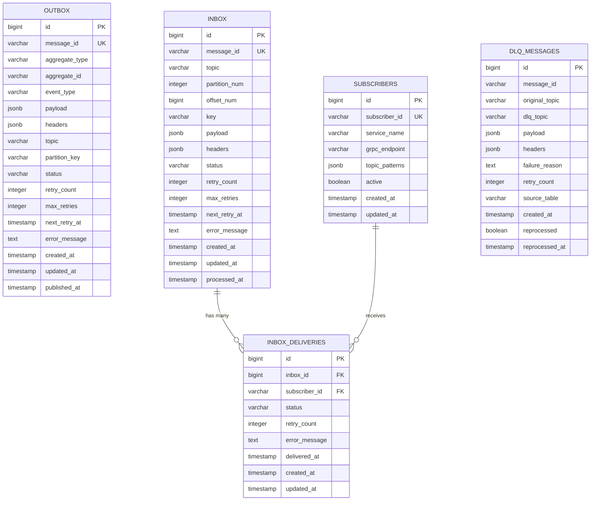

# rs-broker Data Model

## Overview

This document defines the database schemas for the outbox and inbox patterns. All schemas are designed to be database-agnostic, supporting both PostgreSQL and MariaDB through feature flags.

## Database Schema Design Principles

- **Idempotency**: Unique constraints on message IDs prevent duplicate processing
- **Auditability**: Created/updated timestamps on all tables
- **Performance**: Indexes optimized for common query patterns
- **Portability**: Use standard SQL types compatible with PostgreSQL and MariaDB

## Outbox Table Schema

The outbox table stores outgoing messages before they are published to Kafka.

### PostgreSQL Schema

```sql
CREATE TABLE outbox (
    id              BIGSERIAL PRIMARY KEY,
    message_id      VARCHAR(36) NOT NULL,
    aggregate_type  VARCHAR(255) NOT NULL,
    aggregate_id    VARCHAR(255) NOT NULL,
    event_type      VARCHAR(255) NOT NULL,
    payload         JSONB NOT NULL,
    headers         JSONB DEFAULT '{}',
    topic           VARCHAR(255) NOT NULL,
    partition_key   VARCHAR(255),
    status          VARCHAR(20) NOT NULL DEFAULT 'PENDING',
    retry_count     INTEGER NOT NULL DEFAULT 0,
    max_retries     INTEGER NOT NULL DEFAULT 5,
    next_retry_at   TIMESTAMP WITH TIME ZONE,
    error_message   TEXT,
    created_at      TIMESTAMP WITH TIME ZONE NOT NULL DEFAULT NOW(),
    updated_at      TIMESTAMP WITH TIME ZONE NOT NULL DEFAULT NOW(),
    published_at    TIMESTAMP WITH TIME ZONE,
    
    CONSTRAINT uk_outbox_message_id UNIQUE (message_id),
    CONSTRAINT chk_outbox_status CHECK (status IN ('PENDING', 'PUBLISHING', 'PUBLISHED', 'RETRYING', 'FAILED', 'DLQ'))
);

-- Indexes for outbox table
CREATE INDEX idx_outbox_status_created ON outbox (status, created_at) 
    WHERE status IN ('PENDING', 'RETRYING');
    
CREATE INDEX idx_outbox_next_retry ON outbox (next_retry_at) 
    WHERE status = 'RETRYING' AND next_retry_at IS NOT NULL;
    
CREATE INDEX idx_outbox_aggregate ON outbox (aggregate_type, aggregate_id);

CREATE INDEX idx_outbox_topic ON outbox (topic);
```

### MariaDB Schema

```sql
CREATE TABLE outbox (
    id              BIGINT AUTO_INCREMENT PRIMARY KEY,
    message_id      VARCHAR(36) NOT NULL,
    aggregate_type  VARCHAR(255) NOT NULL,
    aggregate_id    VARCHAR(255) NOT NULL,
    event_type      VARCHAR(255) NOT NULL,
    payload         JSON NOT NULL,
    headers         JSON DEFAULT (JSON_OBJECT()),
    topic           VARCHAR(255) NOT NULL,
    partition_key   VARCHAR(255),
    status          VARCHAR(20) NOT NULL DEFAULT 'PENDING',
    retry_count     INT NOT NULL DEFAULT 0,
    max_retries     INT NOT NULL DEFAULT 5,
    next_retry_at   TIMESTAMP(6) NULL,
    error_message   TEXT,
    created_at      TIMESTAMP(6) NOT NULL DEFAULT CURRENT_TIMESTAMP(6),
    updated_at      TIMESTAMP(6) NOT NULL DEFAULT CURRENT_TIMESTAMP(6) ON UPDATE CURRENT_TIMESTAMP(6),
    published_at    TIMESTAMP(6) NULL,
    
    CONSTRAINT uk_outbox_message_id UNIQUE (message_id),
    CONSTRAINT chk_outbox_status CHECK (status IN ('PENDING', 'PUBLISHING', 'PUBLISHED', 'RETRYING', 'FAILED', 'DLQ'))
);

-- Indexes for outbox table
CREATE INDEX idx_outbox_status_created ON outbox (status, created_at);
CREATE INDEX idx_outbox_next_retry ON outbox (next_retry_at);
CREATE INDEX idx_outbox_aggregate ON outbox (aggregate_type, aggregate_id);
CREATE INDEX idx_outbox_topic ON outbox (topic);
```

## Inbox Table Schema

The inbox table stores incoming messages consumed from Kafka before dispatching to subscribers.

### PostgreSQL Schema

```sql
CREATE TABLE inbox (
    id              BIGSERIAL PRIMARY KEY,
    message_id      VARCHAR(36) NOT NULL,
    topic           VARCHAR(255) NOT NULL,
    partition_num   INTEGER NOT NULL,
    offset_num      BIGINT NOT NULL,
    key             VARCHAR(255),
    payload         JSONB NOT NULL,
    headers         JSONB DEFAULT '{}',
    status          VARCHAR(20) NOT NULL DEFAULT 'RECEIVED',
    retry_count     INTEGER NOT NULL DEFAULT 0,
    max_retries     INTEGER NOT NULL DEFAULT 5,
    next_retry_at   TIMESTAMP WITH TIME ZONE,
    error_message   TEXT,
    created_at      TIMESTAMP WITH TIME ZONE NOT NULL DEFAULT NOW(),
    updated_at      TIMESTAMP WITH TIME ZONE NOT NULL DEFAULT NOW(),
    processed_at    TIMESTAMP WITH TIME ZONE,
    
    CONSTRAINT uk_inbox_message_id UNIQUE (message_id),
    CONSTRAINT chk_inbox_status CHECK (status IN ('RECEIVED', 'PROCESSING', 'PROCESSED', 'RETRYING', 'FAILED'))
);

-- Indexes for inbox table
CREATE INDEX idx_inbox_status_created ON inbox (status, created_at) 
    WHERE status IN ('RECEIVED', 'RETRYING');
    
CREATE INDEX idx_inbox_topic_partition ON inbox (topic, partition_num, offset_num);

CREATE INDEX idx_inbox_next_retry ON inbox (next_retry_at) 
    WHERE status = 'RETRYING' AND next_retry_at IS NOT NULL;
```

### MariaDB Schema

```sql
CREATE TABLE inbox (
    id              BIGINT AUTO_INCREMENT PRIMARY KEY,
    message_id      VARCHAR(36) NOT NULL,
    topic           VARCHAR(255) NOT NULL,
    partition_num   INT NOT NULL,
    offset_num      BIGINT NOT NULL,
    key             VARCHAR(255),
    payload         JSON NOT NULL,
    headers         JSON DEFAULT (JSON_OBJECT()),
    status          VARCHAR(20) NOT NULL DEFAULT 'RECEIVED',
    retry_count     INT NOT NULL DEFAULT 0,
    max_retries     INT NOT NULL DEFAULT 5,
    next_retry_at   TIMESTAMP(6) NULL,
    error_message   TEXT,
    created_at      TIMESTAMP(6) NOT NULL DEFAULT CURRENT_TIMESTAMP(6),
    updated_at      TIMESTAMP(6) NOT NULL DEFAULT CURRENT_TIMESTAMP(6) ON UPDATE CURRENT_TIMESTAMP(6),
    processed_at    TIMESTAMP(6) NULL,
    
    CONSTRAINT uk_inbox_message_id UNIQUE (message_id),
    CONSTRAINT chk_inbox_status CHECK (status IN ('RECEIVED', 'PROCESSING', 'PROCESSED', 'RETRYING', 'FAILED'))
);

-- Indexes for inbox table
CREATE INDEX idx_inbox_status_created ON inbox (status, created_at);
CREATE INDEX idx_inbox_topic_partition ON inbox (topic, partition_num, offset_num);
CREATE INDEX idx_inbox_next_retry ON inbox (next_retry_at);
```

## Subscriber Table Schema

Stores subscriber service registrations for fan-out delivery.

### PostgreSQL Schema

```sql
CREATE TABLE subscribers (
    id              BIGSERIAL PRIMARY KEY,
    subscriber_id   VARCHAR(255) NOT NULL,
    service_name    VARCHAR(255) NOT NULL,
    grpc_endpoint   VARCHAR(500) NOT NULL,
    topic_patterns  JSONB NOT NULL DEFAULT '[]',
    active          BOOLEAN NOT NULL DEFAULT true,
    created_at      TIMESTAMP WITH TIME ZONE NOT NULL DEFAULT NOW(),
    updated_at      TIMESTAMP WITH TIME ZONE NOT NULL DEFAULT NOW(),
    
    CONSTRAINT uk_subscribers_subscriber_id UNIQUE (subscriber_id)
);

-- Indexes
CREATE INDEX idx_subscribers_active ON subscribers (active) WHERE active = true;
CREATE INDEX idx_subscribers_service ON subscribers (service_name);
```

### MariaDB Schema

```sql
CREATE TABLE subscribers (
    id              BIGINT AUTO_INCREMENT PRIMARY KEY,
    subscriber_id   VARCHAR(255) NOT NULL,
    service_name    VARCHAR(255) NOT NULL,
    grpc_endpoint   VARCHAR(500) NOT NULL,
    topic_patterns  JSON NOT NULL DEFAULT (JSON_ARRAY()),
    active          BOOLEAN NOT NULL DEFAULT true,
    created_at      TIMESTAMP(6) NOT NULL DEFAULT CURRENT_TIMESTAMP(6),
    updated_at      TIMESTAMP(6) NOT NULL DEFAULT CURRENT_TIMESTAMP(6) ON UPDATE CURRENT_TIMESTAMP(6),
    
    CONSTRAINT uk_subscribers_subscriber_id UNIQUE (subscriber_id)
);

-- Indexes
CREATE INDEX idx_subscribers_active ON subscribers (active);
CREATE INDEX idx_subscribers_service ON subscribers (service_name);
```

## Inbox Delivery Table Schema

Tracks individual delivery attempts to each subscriber for inbox messages.

### PostgreSQL Schema

```sql
CREATE TABLE inbox_deliveries (
    id              BIGSERIAL PRIMARY KEY,
    inbox_id        BIGINT NOT NULL,
    subscriber_id   VARCHAR(255) NOT NULL,
    status          VARCHAR(20) NOT NULL DEFAULT 'PENDING',
    retry_count     INTEGER NOT NULL DEFAULT 0,
    error_message   TEXT,
    delivered_at    TIMESTAMP WITH TIME ZONE,
    created_at      TIMESTAMP WITH TIME ZONE NOT NULL DEFAULT NOW(),
    updated_at      TIMESTAMP WITH TIME ZONE NOT NULL DEFAULT NOW(),
    
    CONSTRAINT fk_inbox_deliveries_inbox FOREIGN KEY (inbox_id) 
        REFERENCES inbox(id) ON DELETE CASCADE,
    CONSTRAINT uk_inbox_deliveries UNIQUE (inbox_id, subscriber_id),
    CONSTRAINT chk_inbox_deliveries_status CHECK (status IN ('PENDING', 'DELIVERING', 'DELIVERED', 'FAILED', 'RETRYING'))
);

-- Indexes
CREATE INDEX idx_inbox_deliveries_inbox ON inbox_deliveries (inbox_id);
CREATE INDEX idx_inbox_deliveries_status ON inbox_deliveries (status, subscriber_id);
```

### MariaDB Schema

```sql
CREATE TABLE inbox_deliveries (
    id              BIGINT AUTO_INCREMENT PRIMARY KEY,
    inbox_id        BIGINT NOT NULL,
    subscriber_id   VARCHAR(255) NOT NULL,
    status          VARCHAR(20) NOT NULL DEFAULT 'PENDING',
    retry_count     INT NOT NULL DEFAULT 0,
    error_message   TEXT,
    delivered_at    TIMESTAMP(6) NULL,
    created_at      TIMESTAMP(6) NOT NULL DEFAULT CURRENT_TIMESTAMP(6),
    updated_at      TIMESTAMP(6) NOT NULL DEFAULT CURRENT_TIMESTAMP(6) ON UPDATE CURRENT_TIMESTAMP(6),
    
    CONSTRAINT fk_inbox_deliveries_inbox FOREIGN KEY (inbox_id) 
        REFERENCES inbox(id) ON DELETE CASCADE,
    CONSTRAINT uk_inbox_deliveries UNIQUE (inbox_id, subscriber_id),
    CONSTRAINT chk_inbox_deliveries_status CHECK (status IN ('PENDING', 'DELIVERING', 'DELIVERED', 'FAILED', 'RETRYING'))
);

-- Indexes
CREATE INDEX idx_inbox_deliveries_inbox ON inbox_deliveries (inbox_id);
CREATE INDEX idx_inbox_deliveries_status ON inbox_deliveries (status, subscriber_id);
```

## Dead Letter Queue Table Schema

Tracks messages routed to DLQ for monitoring and reprocessing.

### PostgreSQL Schema

```sql
CREATE TABLE dlq_messages (
    id              BIGSERIAL PRIMARY KEY,
    message_id      VARCHAR(36) NOT NULL,
    original_topic  VARCHAR(255) NOT NULL,
    dlq_topic       VARCHAR(255) NOT NULL,
    payload         JSONB NOT NULL,
    headers         JSONB DEFAULT '{}',
    failure_reason  TEXT NOT NULL,
    retry_count     INTEGER NOT NULL,
    source_table    VARCHAR(20) NOT NULL,  -- 'OUTBOX' or 'INBOX'
    created_at      TIMESTAMP WITH TIME ZONE NOT NULL DEFAULT NOW(),
    reprocessed     BOOLEAN NOT NULL DEFAULT false,
    reprocessed_at  TIMESTAMP WITH TIME ZONE,
    
    CONSTRAINT chk_dlq_source_table CHECK (source_table IN ('OUTBOX', 'INBOX'))
);

-- Indexes
CREATE INDEX idx_dlq_topic ON dlq_messages (original_topic);
CREATE INDEX idx_dlq_created ON dlq_messages (created_at);
CREATE INDEX idx_dlq_reprocessed ON dlq_messages (reprocessed) WHERE reprocessed = false;
```

### MariaDB Schema

```sql
CREATE TABLE dlq_messages (
    id              BIGINT AUTO_INCREMENT PRIMARY KEY,
    message_id      VARCHAR(36) NOT NULL,
    original_topic  VARCHAR(255) NOT NULL,
    dlq_topic       VARCHAR(255) NOT NULL,
    payload         JSON NOT NULL,
    headers         JSON DEFAULT (JSON_OBJECT()),
    failure_reason  TEXT NOT NULL,
    retry_count     INT NOT NULL,
    source_table    VARCHAR(20) NOT NULL,  -- 'OUTBOX' or 'INBOX'
    created_at      TIMESTAMP(6) NOT NULL DEFAULT CURRENT_TIMESTAMP(6),
    reprocessed     BOOLEAN NOT NULL DEFAULT false,
    reprocessed_at  TIMESTAMP(6) NULL,
    
    CONSTRAINT chk_dlq_source_table CHECK (source_table IN ('OUTBOX', 'INBOX'))
);

-- Indexes
CREATE INDEX idx_dlq_topic ON dlq_messages (original_topic);
CREATE INDEX idx_dlq_created ON dlq_messages (created_at);
CREATE INDEX idx_dlq_reprocessed ON dlq_messages (reprocessed);
```

## Entity Relationship Diagram



## Status Enumerations

### Outbox Status

| Status | Description |
|--------|-------------|
| `PENDING` | Message created, awaiting publication |
| `PUBLISHING` | Currently being published to Kafka |
| `PUBLISHED` | Successfully published to Kafka |
| `RETRYING` | Publication failed, scheduled for retry |
| `FAILED` | All retries exhausted, marked as failed |
| `DLQ` | Routed to Dead Letter Queue |

### Inbox Status

| Status | Description |
|--------|-------------|
| `RECEIVED` | Message consumed from Kafka, awaiting processing |
| `PROCESSING` | Currently being dispatched to subscribers |
| `PROCESSED` | Successfully delivered to all subscribers |
| `RETRYING` | Delivery failed, scheduled for retry |
| `FAILED` | All retries exhausted, marked as failed |

### Delivery Status

| Status | Description |
|--------|-------------|
| `PENDING` | Delivery not yet attempted |
| `DELIVERING` | Currently being delivered |
| `DELIVERED` | Successfully delivered |
| `RETRYING` | Delivery failed, scheduled for retry |
| `FAILED` | All retries exhausted |

## Rust Type Mappings

```rust
// Outbox entity
pub struct OutboxMessage {
    pub id: i64,
    pub message_id: String,
    pub aggregate_type: String,
    pub aggregate_id: String,
    pub event_type: String,
    pub payload: serde_json::Value,
    pub headers: serde_json::Value,
    pub topic: String,
    pub partition_key: Option<String>,
    pub status: OutboxStatus,
    pub retry_count: i32,
    pub max_retries: i32,
    pub next_retry_at: Option<DateTime<Utc>>,
    pub error_message: Option<String>,
    pub created_at: DateTime<Utc>,
    pub updated_at: DateTime<Utc>,
    pub published_at: Option<DateTime<Utc>>,
}

// Inbox entity
pub struct InboxMessage {
    pub id: i64,
    pub message_id: String,
    pub topic: String,
    pub partition_num: i32,
    pub offset_num: i64,
    pub key: Option<String>,
    pub payload: serde_json::Value,
    pub headers: serde_json::Value,
    pub status: InboxStatus,
    pub retry_count: i32,
    pub max_retries: i32,
    pub next_retry_at: Option<DateTime<Utc>>,
    pub error_message: Option<String>,
    pub created_at: DateTime<Utc>,
    pub updated_at: DateTime<Utc>,
    pub processed_at: Option<DateTime<Utc>>,
}

// Status enums
#[derive(Debug, Clone, sqlx::Type)]
#[sqlx(type_name = "VARCHAR", rename_all = "SCREAMING_SNAKE_CASE")]
pub enum OutboxStatus {
    Pending,
    Publishing,
    Published,
    Retrying,
    Failed,
    Dlq,
}

#[derive(Debug, Clone, sqlx::Type)]
#[sqlx(type_name = "VARCHAR", rename_all = "SCREAMING_SNAKE_CASE")]
pub enum InboxStatus {
    Received,
    Processing,
    Processed,
    Retrying,
    Failed,
}
```

## Migration Strategy

### Version Control

All migrations are stored in `migrations/` directory with timestamp prefixes:

```
migrations/
├── 20260227000000_create_outbox.sql
├── 20260227000001_create_inbox.sql
├── 20260227000002_create_subscribers.sql
├── 20260227000003_create_inbox_deliveries.sql
└── 20260227000004_create_dlq_messages.sql
```

### Feature Flag Based Selection

```rust
// In Cargo.toml
[features]
default = ["postgres"]
postgres = ["sqlx/postgres"]
mysql = ["sqlx/mysql"]

// In migration module
#[cfg(feature = "postgres")]
mod postgres;

#[cfg(feature = "mysql")]
mod mysql;
```
