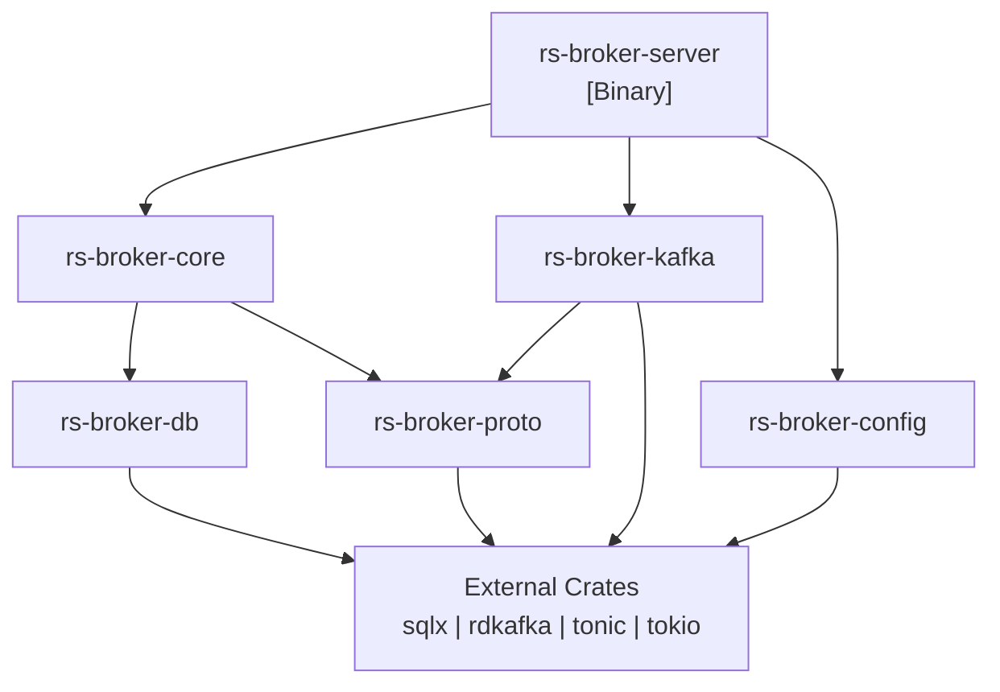

# rs-broker Project Structure

## Overview

This document defines the Rust module structure and crate organization for the rs-broker microservice. The project follows a modular architecture with clear separation of concerns.

## Crate Organization

The project is organized as a Cargo workspace with multiple crates:

```
rs-broker/
├── Cargo.toml                    # Workspace root
├── crates/
│   ├── rs-broker-server/         # Main server binary
│   ├── rs-broker-core/           # Core business logic
│   ├── rs-broker-proto/          # Generated protobuf code
│   ├── rs-broker-db/             # Database layer
│   ├── rs-broker-kafka/          # Kafka integration
│   └── rs-broker-config/         # Configuration management
├── proto/
│   └── rs_broker.proto           # gRPC service definitions
├── migrations/                    # Database migrations
├── docs/                          # Documentation
└── tests/                         # Integration tests
```

## Workspace Cargo.toml

```toml
[workspace]
resolver = "2"
members = [
    "crates/rs-broker-server",
    "crates/rs-broker-core",
    "crates/rs-broker-proto",
    "crates/rs-broker-db",
    "crates/rs-broker-kafka",
    "crates/rs-broker-config",
]

[workspace.package]
version = "0.1.0"
edition = "2021"
rust-version = "1.75"
authors = ["Bouroo Team"]
license = "MIT"

[workspace.dependencies]
# Async runtime
tokio = { version = "1.35", features = ["full"] }
tokio-stream = "0.1"
futures = "0.3"

# gRPC
tonic = "0.10"
tonic-build = "0.10"
prost = "0.12"
prost-types = "0.12"

# HTTP/Web
axum = "0.7"
tower = "0.4"
tower-http = { version = "0.5", features = ["trace", "cors"] }

# Database
sqlx = { version = "0.7", features = ["runtime-tokio", "tls-rustls", "json", "chrono", "uuid"] }

# Kafka
rdkafka = { version = "0.36", features = ["tokio", "cmake-build"] }

# Serialization
serde = { version = "1.0", features = ["derive"] }
serde_json = "1.0"

# Configuration
config = "0.14"
dotenvy = "0.15"

# Observability
tracing = "0.1"
tracing-subscriber = { version = "0.3", features = ["env-filter", "json"] }

# Error handling
thiserror = "1.0"
anyhow = "1.0"

# Utilities
uuid = { version = "1.6", features = ["v4", "serde"] }
chrono = { version = "0.4", features = ["serde"] }
async-trait = "0.1"

# Internal crates
rs-broker-core = { path = "crates/rs-broker-core" }
rs-broker-proto = { path = "crates/rs-broker-proto" }
rs-broker-db = { path = "crates/rs-broker-db" }
rs-broker-kafka = { path = "crates/rs-broker-kafka" }
rs-broker-config = { path = "crates/rs-broker-config" }
```

## Crate Details

### 1. rs-broker-server

Main server binary that wires everything together.

```
crates/rs-broker-server/
├── Cargo.toml
└── src/
    ├── main.rs              # Entry point
    ├── lib.rs               # Library exports
    ├── server.rs            # Axum/gRPC server setup
    ├── grpc_service.rs      # gRPC service implementation
    └── shutdown.rs          # Graceful shutdown handling
```

**Dependencies:**
- All internal crates
- tonic, axum, tower
- tracing

**Purpose:**
- Initialize and run the server
- Wire up all components
- Handle graceful shutdown

### 2. rs-broker-core

Core business logic for inbox/outbox patterns.

```
crates/rs-broker-core/
├── Cargo.toml
└── src/
    ├── lib.rs
    ├── outbox/
    │   ├── mod.rs
    │   ├── manager.rs       # Outbox business logic
    │   ├── publisher.rs     # Background publisher worker
    │   └── retry.rs         # Retry strategy implementation
    ├── inbox/
    │   ├── mod.rs
    │   ├── manager.rs       # Inbox business logic
    │   ├── dispatcher.rs    # gRPC dispatcher to subscribers
    │   └── dedup.rs         # Deduplication logic
    ├── dlq/
    │   ├── mod.rs
    │   └── handler.rs       # DLQ routing and management
    ├── subscriber/
    │   ├── mod.rs
    │   └── registry.rs      # Subscriber registration
    └── error.rs             # Domain errors
```

**Dependencies:**
- rs-broker-proto
- rs-broker-db
- rs-broker-kafka
- rs-broker-config
- tokio, async-trait, thiserror

**Purpose:**
- Implement outbox pattern logic
- Implement inbox pattern logic
- Handle retry strategies
- Manage subscriber registry

### 3. rs-broker-proto

Generated protobuf code and types.

```
crates/rs-broker-proto/
├── Cargo.toml
├── build.rs                 # Code generation script
└── src/
    ├── lib.rs
    └── rsbroker.rs          # Generated code (gitignored)
```

**Dependencies:**
- tonic, prost

**Purpose:**
- Generate Rust types from proto
- Export gRPC client/server traits

### 4. rs-broker-db

Database layer with database-agnostic support.

```
crates/rs-broker-db/
├── Cargo.toml
└── src/
    ├── lib.rs
    ├── pool.rs              # Connection pool management
    ├── outbox/
    │   ├── mod.rs
    │   ├── entity.rs        # Outbox entity types
    │   └── repository.rs    # Outbox CRUD operations
    ├── inbox/
    │   ├── mod.rs
    │   ├── entity.rs        # Inbox entity types
    │   └── repository.rs    # Inbox CRUD operations
    ├── subscriber/
    │   ├── mod.rs
    │   ├── entity.rs        # Subscriber entity types
    │   └── repository.rs    # Subscriber CRUD operations
    ├── dlq/
    │   ├── mod.rs
    │   ├── entity.rs        # DLQ entity types
    │   └── repository.rs    # DLQ CRUD operations
    └── migration.rs         # Migration utilities
```

**Dependencies:**
- sqlx (with postgres/mysql features)
- serde, chrono, uuid
- rs-broker-config

**Purpose:**
- Database connection management
- Entity definitions
- Repository pattern for data access

### 5. rs-broker-kafka

Kafka producer and consumer integration.

```
crates/rs-broker-kafka/
├── Cargo.toml
└── src/
    ├── lib.rs
    ├── config.rs            # Kafka configuration
    ├── producer/
    │   ├── mod.rs
    │   └── client.rs        # Kafka producer wrapper
    ├── consumer/
    │   ├── mod.rs
    │   └── client.rs        # Kafka consumer wrapper
    ├── headers.rs           # Header utilities
    └── error.rs             # Kafka errors
```

**Dependencies:**
- rdkafka
- tokio, futures
- rs-broker-config

**Purpose:**
- Kafka producer abstraction
- Kafka consumer abstraction
- Header manipulation utilities

### 6. rs-broker-config

Configuration management.

```
crates/rs-broker-config/
├── Cargo.toml
└── src/
    ├── lib.rs
    ├── settings.rs          # Main settings structure
    ├── server.rs            # Server configuration
    ├── database.rs          # Database configuration
    ├── kafka.rs             # Kafka configuration
    ├── grpc.rs              # gRPC configuration
    └── retry.rs             # Retry policy configuration
```

**Dependencies:**
- config, dotenvy
- serde, serde_json

**Purpose:**
- Load configuration from files and env
- Provide typed configuration structs
- Validate configuration values

## Module Dependency Graph



## Feature Flags

### Workspace Features

```toml
# In workspace Cargo.toml
[workspace.features]
default = ["postgres", "tracing"]
postgres = ["sqlx/postgres"]
mysql = ["sqlx/mysql"]
tracing = ["tracing-subscriber/json"]
```

### Crate-Specific Features

```toml
# In rs-broker-db/Cargo.toml
[features]
default = ["postgres"]
postgres = ["sqlx/postgres"]
mysql = ["sqlx/mysql"]
```

## Source File Structure

```
rs-broker/
├── Cargo.toml
├── Cargo.lock
├── .gitignore
├── LICENSE
├── README.md
│
├── crates/
│   ├── rs-broker-server/
│   │   ├── Cargo.toml
│   │   └── src/
│   │       ├── main.rs
│   │       ├── lib.rs
│   │       ├── server.rs
│   │       ├── grpc_service.rs
│   │       └── shutdown.rs
│   │
│   ├── rs-broker-core/
│   │   ├── Cargo.toml
│   │   └── src/
│   │       ├── lib.rs
│   │       ├── error.rs
│   │       ├── outbox/
│   │       │   ├── mod.rs
│   │       │   ├── manager.rs
│   │       │   ├── publisher.rs
│   │       │   └── retry.rs
│   │       ├── inbox/
│   │       │   ├── mod.rs
│   │       │   ├── manager.rs
│   │       │   ├── dispatcher.rs
│   │       │   └── dedup.rs
│   │       ├── dlq/
│   │       │   ├── mod.rs
│   │       │   └── handler.rs
│   │       └── subscriber/
│   │           ├── mod.rs
│   │           └── registry.rs
│   │
│   ├── rs-broker-proto/
│   │   ├── Cargo.toml
│   │   ├── build.rs
│   │   └── src/
│   │       └── lib.rs
│   │
│   ├── rs-broker-db/
│   │   ├── Cargo.toml
│   │   └── src/
│   │       ├── lib.rs
│   │       ├── pool.rs
│   │       ├── migration.rs
│   │       ├── outbox/
│   │       │   ├── mod.rs
│   │       │   ├── entity.rs
│   │       │   └── repository.rs
│   │       ├── inbox/
│   │       │   ├── mod.rs
│   │       │   ├── entity.rs
│   │       │   └── repository.rs
│   │       ├── subscriber/
│   │       │   ├── mod.rs
│   │       │   ├── entity.rs
│   │       │   └── repository.rs
│   │       └── dlq/
│   │           ├── mod.rs
│   │           ├── entity.rs
│   │           └── repository.rs
│   │
│   ├── rs-broker-kafka/
│   │   ├── Cargo.toml
│   │   └── src/
│   │       ├── lib.rs
│   │       ├── config.rs
│   │       ├── error.rs
│   │       ├── headers.rs
│   │       ├── producer/
│   │       │   ├── mod.rs
│   │       │   └── client.rs
│   │       └── consumer/
│   │           ├── mod.rs
│   │           └── client.rs
│   │
│   └── rs-broker-config/
│       ├── Cargo.toml
│       └── src/
│           ├── lib.rs
│           ├── settings.rs
│           ├── server.rs
│           ├── database.rs
│           ├── kafka.rs
│           ├── grpc.rs
│           └── retry.rs
│
├── proto/
│   └── rs_broker.proto
│
├── migrations/
│   ├── 20260227000000_create_outbox.sql
│   ├── 20260227000001_create_inbox.sql
│   ├── 20260227000002_create_subscribers.sql
│   ├── 20260227000003_create_inbox_deliveries.sql
│   └── 20260227000004_create_dlq_messages.sql
│
├── config/
│   ├── default.toml
│   ├── development.toml
│   ├── production.toml
│   └── test.toml
│
├── docs/
│   ├── architecture.md
│   ├── data-model.md
│   ├── grpc-proto.md
│   ├── project-structure.md
│   └── configuration.md
│
└── tests/
    ├── integration/
    │   ├── outbox_test.rs
    │   ├── inbox_test.rs
    │   └── e2e_test.rs
    └── fixtures/
        └── test-data.json
```

## Key Module Interfaces

### Core Module Exports

```rust
// crates/rs-broker-core/src/lib.rs
pub mod outbox;
pub mod inbox;
pub mod dlq;
pub mod subscriber;
pub mod error;

pub use outbox::OutboxManager;
pub use inbox::InboxManager;
pub use dlq::DlqHandler;
pub use subscriber::SubscriberRegistry;
pub use error::{Error, Result};
```

### Database Module Exports

```rust
// crates/rs-broker-db/src/lib.rs
pub mod pool;
pub mod outbox;
pub mod inbox;
pub mod subscriber;
pub mod dlq;

pub use pool::create_pool;
pub use outbox::{OutboxMessage, OutboxRepository};
pub use inbox::{InboxMessage, InboxRepository};
pub use subscriber::{Subscriber, SubscriberRepository};
pub use dlq::{DlqMessage, DlqRepository};
```

### Kafka Module Exports

```rust
// crates/rs-broker-kafka/src/lib.rs
pub mod producer;
pub mod consumer;
pub mod headers;
pub mod config;
pub mod error;

pub use producer::KafkaProducer;
pub use consumer::KafkaConsumer;
pub use headers::MessageHeaders;
pub use error::{KafkaError, Result};
```

## Build Commands

```bash
# Build all crates
cargo build

# Build with PostgreSQL support
cargo build --features postgres

# Build with MariaDB support
cargo build --features mysql

# Build release
cargo build --release

# Run tests
cargo test

# Run with specific config
cargo run -- --config config/development.toml

# Generate documentation
cargo doc --open
```
